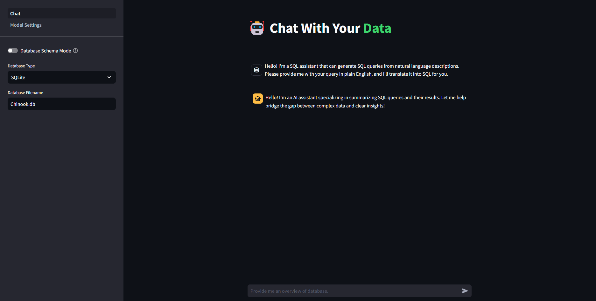

# Chat With Your Data: Text-to-SQL Generation with `Streamlit`, `llama.cpp`🦙 and `LangChain`🦜🔗 
## [Demo Video](https://youtu.be/u1GTnSevnn0)

## Project Description
This project is an innovative application of natural language processing (NLP) and machine learning that bridges the gap between human language and database queries. This technology allows users to interact with databases using natural language, without needing to know complex SQL syntax. This project aims to democratize data access, enabling non-technical users to extract valuable insights from databases.

This project aims to develop a robust Question and Answering System over SQL Data that can:
- Interpret natural language questions about data
- Generate accurate SQL queries based on these questions
- Execute the queries on a target database
- Present the results in a user-friendly format

Some of the key features of the application include:
- Natural language understanding
- SQL query generation
- Database schema comprehension
- Multi-table query support
- Error handling and query optimization
- Human-in-loop control for query execution
- Detailed logging for tracking and debugging
- Safeguards to prevent write operations that modify databases

Whether you're a developer looking to integrate this functionality into your applications, or a data enthusiast interested in exploring databases more intuitively, this project provides a powerful tool for transforming natural language into actionable database queries.

## Architecture
There are two modes available: 
* **Standard Mode:** 
    * SQL Assistant generates SQL query from user's question.
    * Executes query on the database connected.
    * Supports **SQLite** and **PostgreSQL** database.
    * AI Assistant responds to user's question based on query results.


* **Database Schema Mode:** 
    * SQL Assistant generates SQL query from user's question.
    * SQL query is generated as final response to user's question. 
    * No execution of query or database connection.
    


## Setup 
1. Install required dependencies:
```bash
pip install -r requirements.txt
```

## Setup for OpenAI-compatible Web Server
> **Optional:** This section is intended for users who want to set up an OpenAI-compatible web server using llama.cpp instead of using the OpenAI API directly. You are welcomed to use other Open-AI compatible web services.

1. Install llama.cpp. Browse to [llama-cpp-python](https://github.com/abetlen/llama-cpp-python#openai-compatible-web-server) for installation with hardware acceleration.
```bash
pip install llama-cpp-python[server]==0.2.56
```

2. Setup huggingface-cli to download model.
```bash
pip install huggingface-cli
export HUGGING_FACE_HUB_TOKEN=<HF_TOKEN>
```

3. Download .gguf model from HuggingFace based on preference.
```bash
#preferred model for SQL Assistant
huggingface-cli download MaziyarPanahi/sqlcoder-7b-2-GGUF sqlcoder-7b-2.Q8_0.gguf
#preferred model for AI Assistant
huggingface-cli download MaziyarPanahi/Mistral-7B-Instruct-v0.3-GGUF Mistral-7B-Instruct-v0.3.Q8_0.gguf
```

4. Fill in details of model configuration in file `config.json`. Here is a sample:
```
{
    "host": "0.0.0.0",
    "port": 8080,
    "models": [
        {
            "model": "./sqlcoder-7b-2.Q8_0.gguf",
            "model_alias": "sqlcoder-7b-2",
            "n_gpu_layers": -1, 
            "offload_kqv": true,
            "n_threads": 12,
            "n_batch": 512,
            "n_ctx": 8192
        }
    ]
}
```

5. Start web server.
```bash
python3 -m llama_cpp.server --config_file ./config.json
```

6. **[Optional]** View possible server startup parameters
```bash
python3 -m llama_cpp.server --help
```

## Run Application

1. Start application with selected port.
```bash
streamlit run Chat.py --server.port <port>

#Sample:
streamlit run Chat.py --server.port 8501
```

2. Browse to http://localhost:8501 to get access to main page of application.

## Model Settings Page


1. Move to `Model Settings` page to modify settings for **SQL Assistant** or **AI Assistant**.

2. Fill in details such as model name, temperature, API Key and URL.
* Users that use OpenAI API directly should fill in **API Key** and leave **URL** empty.
* Users that use OpenAI-compatible server should fill in **URL** and leave **API Key** empty.

## Prompt Template
> **Optional:** Change prompt template as required especially preferred models mentioned above are not used, but please keep all placeholders unchanged to ensure proper output generation.

* Prompt Template for SQL Assistant
```
### Task
Generate a SQL query to answer [QUESTION]{input}[/QUESTION]

### Database Schema
The query will run on a database with the following schema:

{table_info}

### Chat History
Relevant chat history between user and assistant:

{history}

### Answer
Given the database schema, here is the SQL query that [QUESTION]{input}[/QUESTION]
[SQL]
```

* Prompt Template for SQL Assistant (Regeneration)
```
### Task
Given an original incorrect SQL query, a question, and a detailed database schema, generate a CORRECT SQL query that can be executed on the provided schema to answer the question. 
The regenerated SQL query should learn from the mistakes in the original query and strictly adhere to the database schema.

### Database Schema
The query will run on a database with the following schema:

{table_info}

### Original Incorrect SQL Query

{wrong_sql_query}

### Question
[QUESTION]{input}[/QUESTION]

### Analysis of the Original Incorrect SQL Query
[Provide a detailed analysis of the mistakes or issues in the original incorrect SQL query, such as:
- Syntax errors
- Incorrect table or column names
- Misunderstanding of the schema or relationships
- Logical errors or missing components
- Violation of constraints or data types
- Inefficient or suboptimal query structure]

### Requirements for the Regenerated SQL Query
The regenerated SQL query should:
1. Correctly answer the given question based on the database schema.
2. Learn from the mistakes in the original incorrect SQL query and avoid repeating them.
3. Strictly adhere to the database schema, using correct table and column names, respecting data types and constraints, and handling relationships appropriately.
4. Follow best practices for SQL query structure, readability, and performance optimization.
5. Include any necessary joins, filters, aggregations, or subqueries to retrieve the desired data.
6. Ensure that the output is only the SQL query, without any additional text or explanation.
7. Use the "ILIKE" operator more than the "=" operator to make the query case-insensitive for string comparisons.

[SQL]
```

* Prompt Template for AI Assistant
```
You are a helpful assistant that will generate human-readable response for a question based on sql query and sql results.
You MUST use ALL information provided in sql results below to generate human-readable response for question.
Your response MUST NOT include any codes and be accurate and concise. Do not add on any additional information in your response.

### Chat History
Relevant chat history between user and assistant:

{history}

### Answer
If the sql results is NONE, you MUST reply that you could not answer the question because sql results return nothing.

question : {question}
sql query : {query}
sql results : {results}

Human-readable response: 
```

## Chat Page

1. Move to `Chat` page to choose which working mode to use. The explanation of working modes are explained in [Architecture](#architecture) section above.

2. Fill in details of **SQLite** file or **PostgresSQL** server if using **Standard Mode**.
    > **⚠️Warning⚠️** 
    
    This working mode requires connection with SQL databases. There are inherent risks in doing this although application has implemented safety measures to prevent any modifications or write operations to database. Please make sure your database connection permissions are scoped as narrowly as possible just for read operations.

3. Fill in database schema if using **Database Schema Mode**.

## Example Outputs
### Find numbers of customers from Brazil:


### Find artists that have released the most albums:


### Find number of products with regeneration prompt from SQL Assistant:


## References

* MaziyarPanahi/sqlcoder-7b-2-GGUF (https://huggingface.co/MaziyarPanahi/sqlcoder-7b-2-GGUF)
* MaziyarPanahi/Mistral-7B-Instruct-v0.3-GGUF (https://huggingface.co/MaziyarPanahi/Mistral-7B-Instruct-v0.3-GGUF)
* llama-cpp-python (https://github.com/abetlen/llama-cpp-python)
* streamlit (https://streamlit.io)
* langchain (https://www.langchain.com/langchain)
